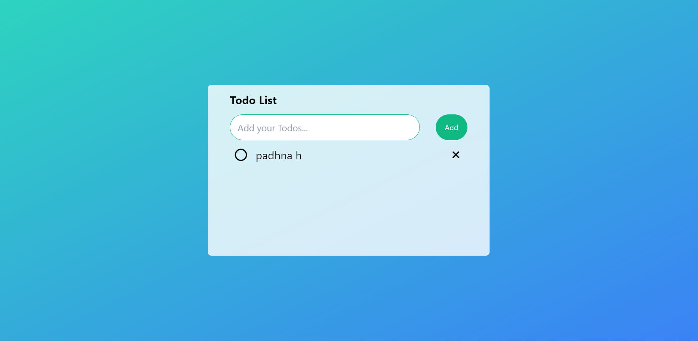

# Responsive Todo Application

A simple responsive todo application built using React and styled with Tailwind CSS. Allows users to add, remove, and mark tasks as completed.

## Features

- Add tasks
- Remove tasks
- Mark tasks as completed
- Responsive design

## Technologies Used

- React
- Tailwind CSS

## Installation

1. Clone the repository:

[Clone](https://github.com/AnuragSingh013/todo-app.git)
